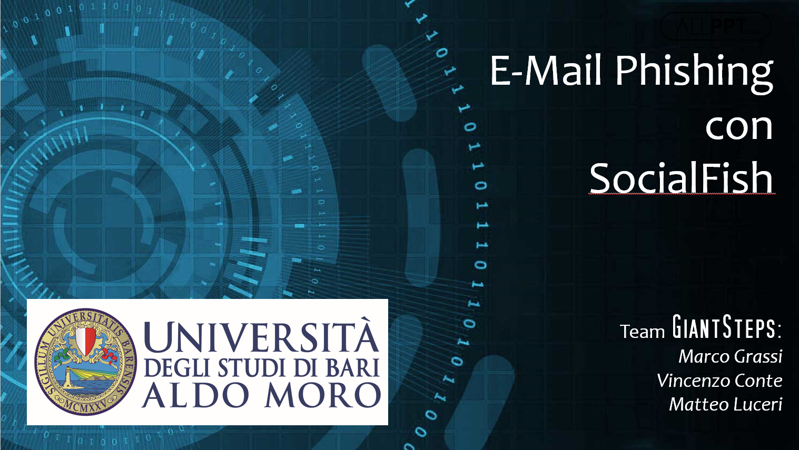
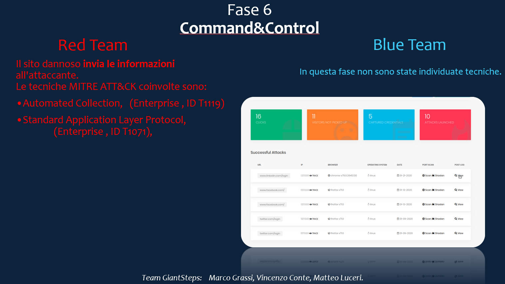

# UNIBA_SI_PhishingAttackWithSocialFish

 
The project focuses on the analysis of a hypothetical attack using the SocialFish tool. References for documentation and turorials to the tool are available on [GitHub](https://github.com/UndeadSec/SocialFish).

The analysis aims at identifying red team and blue team techniques in the respective attack / defense phases highlighted in the proposed killchain.
